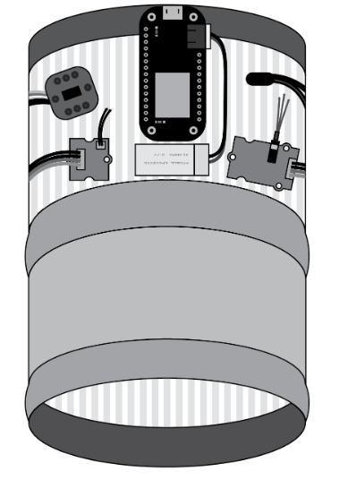
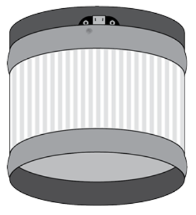

# InspiritFull

This is a webapp and server that I made for my final project in my senior year.  The goal of it was to use an arduino and a phone to try and measure and predict stress levels for an individual.  We were hoping to create a cheap way for people who suffered from anxiety to be able to easily keep track of how they were feeling.

My parter and I created an armband that would track the user's vital signs and report them back to the phone application via Bluetooth LE.  The application would then relay that information back to a node server, where we would run some predictions with a Python script.  The code base isn't nearly as clean as it could be; the assignment was more about developing project management skills than producing a working and well written codebase.

Training data was produced by fighting against a boss in Dark Souls 3.  When we had enough data, we put it to the test using other games and class presentations.  The project was largely a success, and we were one of the few groups given the oppertunity to present it to a few investors at a school event.

## Armband Contents

Parts List:
* [Adafruit Feather M0 Bluefruit LE](https://www.adafruit.com/product/2995)
* [Grove - EMG Detector](https://www.seeedstudio.com/Grove-EMG-Detector-p-1737.html)
* [Grove - GSR sensor](https://www.seeedstudio.com/Grove-GSR-sensor-p-1614.html)
* [MAXREFDES117#: HEART-RATE AND PULSE-OXIMETRY MONITOR](https://www.seeedstudio.com/MAXREFDES117-HEART-RATE-AND-PULSE-OXIMETRY-MONITOR-p-2762.html)

